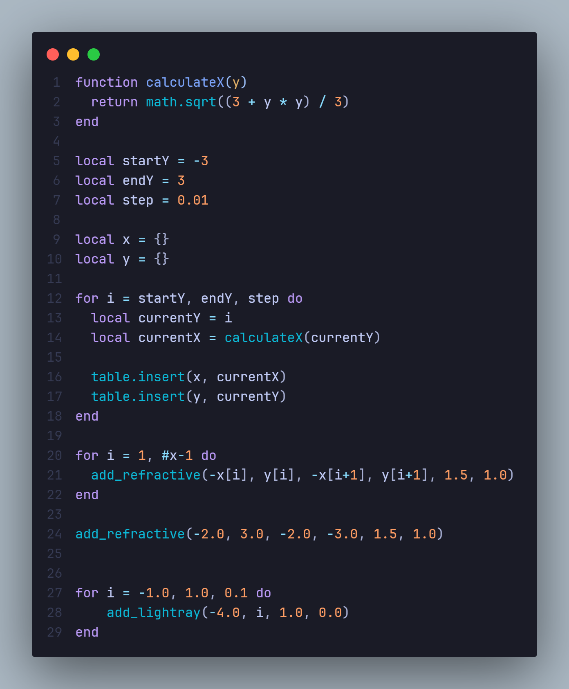
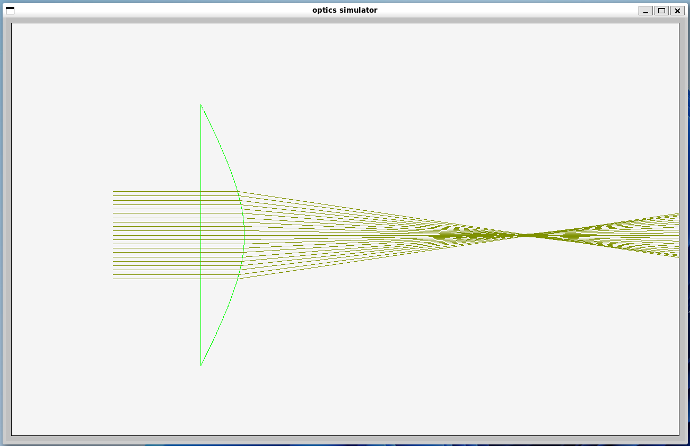

# A Naive Optical Simulation Program

A naive optical simulation program based on FLTK, designed to analyze light paths as they pass through ideal convex lenses, ideal concave lenses, and plane mirrors.

This Program can be applied in optical system design and analysis, helping users understand the behavior of light rays on various components.

## 1 Getting Started

### 1.1 Install Dependencies

```bash
sudo apt install libfltk1.3-dev
sudo apt install lua5.3 liblua5.3-dev
```

### 1.2 Compile

```bash
make
```

### 1.3 Run


```bash
./build/program
```

## 2 Manuals and Demo

### 2.1 Write a Layout Script

This program depends on user-defined [Lua](https://www.lua.org/) scripts to define the layout of light rays and optical components, with following interfaces:

- `add_lightray(start_x, start_y, direction_x, direction_y)`: Adds a light ray starting at `(start_x, start_y)` with direction `(direction_x, direction_y)`.
- `add_lens(start_x, start_y, end_x, end_y, foc_len)`: Adds a lens starting at `(start_x, start_y)` and ending at `(end_x, end_y)`, with a focal length of `foc_len` (positive for convex lenses and negative for concave lenses).
- `add_refractive(start_x, start_y, end_x, end_y, n_left, n_right)`: Adds a refractive surface starting at `(start_x, start_y)` and ending at `(end_x, end_y)`, with `n_left` and `n_right` representing the refractive indices on the left and right sides, respectively.
- `add_mirror(start_x, start_y, end_x, end_y)`: Adds a mirror starting at `(start_x, start_y)` and ending at `(end_x, end_y)`, capable of reflecting on both sides.

### 2.2 Demo

After launching the program and selecting a layout script, it will display the simulation results. You can drag the mouse and scroll to move and zoom the window.


### 2.3 Customization

Since the program uses Lua for layout definitions, you can leverage Lua's capabilities to implement further custom settings, such as creating a curved optical element:



Simulation Result:



## 3. Extending the Program

If you want to add new optical components to this program, the first step is to declare and implement a new optical component class in `include/optics.h` and `src/optics.cpp`, inheriting from the `Deflector` interface. You will need to implement the `Incidence` and `Emergence` functions, which handle the specific calculations for incoming and outgoing rays.

The second step involves defining the appearance of this optical component. In `include/gui.h` and `src/gui.cpp`, create an `Element` class that inherits from the `Element` interface as well as your newly added optical component class. Implement the `Draw` function, which specifies how to render this optical component in the window.

The third step is to define a Lua function for adding this optical component. In the `LuaUI` singleton class within `include/gui.h` and `src/gui.cpp`, add a functor to handle the Lua function calls. Finally, register this Lua function in the constructor of the `OpticsBox`.

After making the modifications, recompile and run the program to check if the results meet your expectations.

